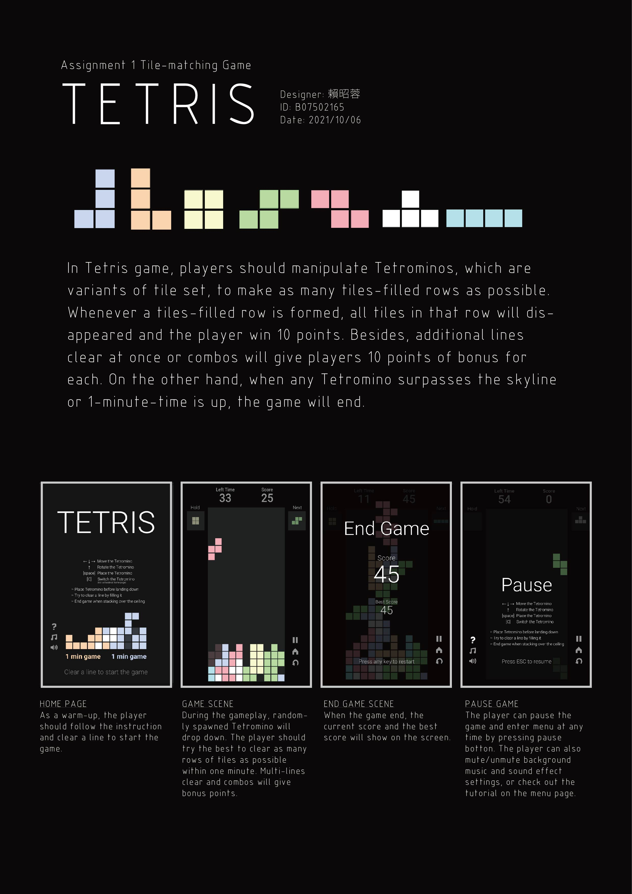
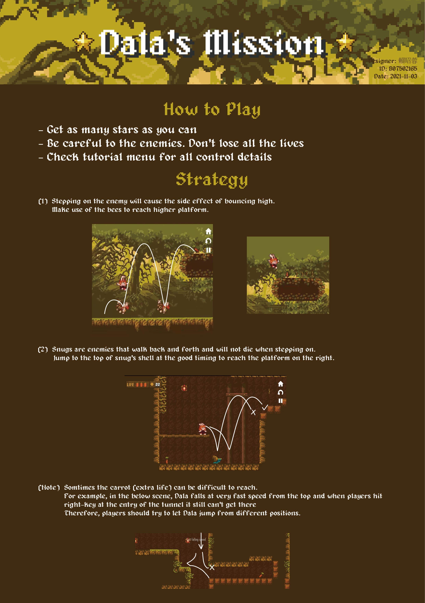
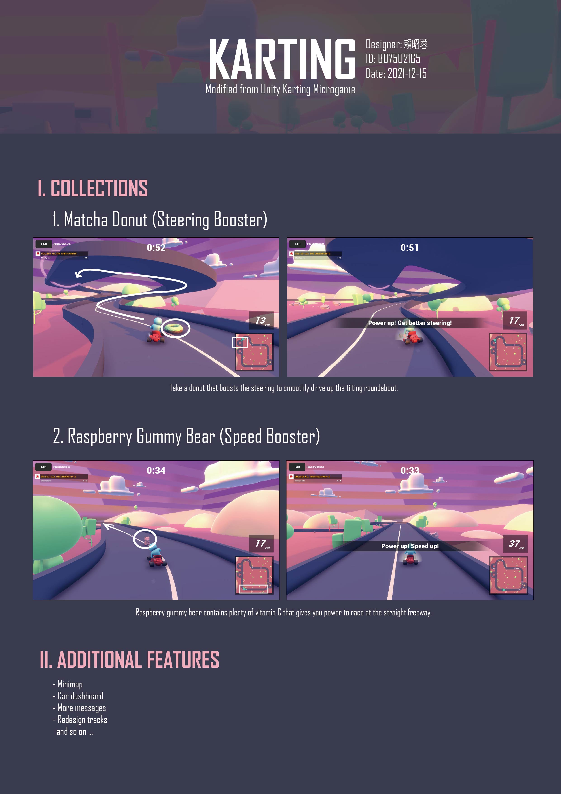

# 2021 Fall | Game Programming
Since the Unity projects are typically large and can excede size limit of github, I didn't put source codes here. Please contact me if you are interested in them.

### HW1 - Tile Matching Game: *Tetris*

Unity Play: [Tetris](https://play.unity.com/mg/other/webgl-builds-108155)  

### HW2 - 2D Platformer: *Dala's Mission*

Unity Play: [Dala's Mission](https://play.unity.com/mg/other/hw2-build-2)  
Demo: [Video](https://youtu.be/29xxQ5bbaiw)

### HW3 - 3D Game: *Karting*

Unity Play: [Karting](https://play.unity.com/mg/karting/hw3-build-4)  
Demo: [Video](https://youtu.be/ElFyw8cIbhQ)

### Final Project - *各有所圖 LibraryGang*
_LibraryGang_ is an online multiplayer game. In the school library, the bad students cooperate to complete evil tasks such as eating instant noddles and dancing loud. The librarian, on the other hand, should stop bad students from being naughty. When the students are caught doing evil things, they cannot do any task for a period of time. In addition, the librarian should also deal with administrative work such as lending books, which might be intentionally added by bad students to distract the librarian. 

Demo:
<!-- <iframe width="560" height="315" src="https://www.youtube.com/embed/EIQV8R4bcKc" title="YouTube video player" frameborder="0" allow="accelerometer; autoplay; clipboard-write; encrypted-media; gyroscope; picture-in-picture; web-share" allowfullscreen></iframe> -->
