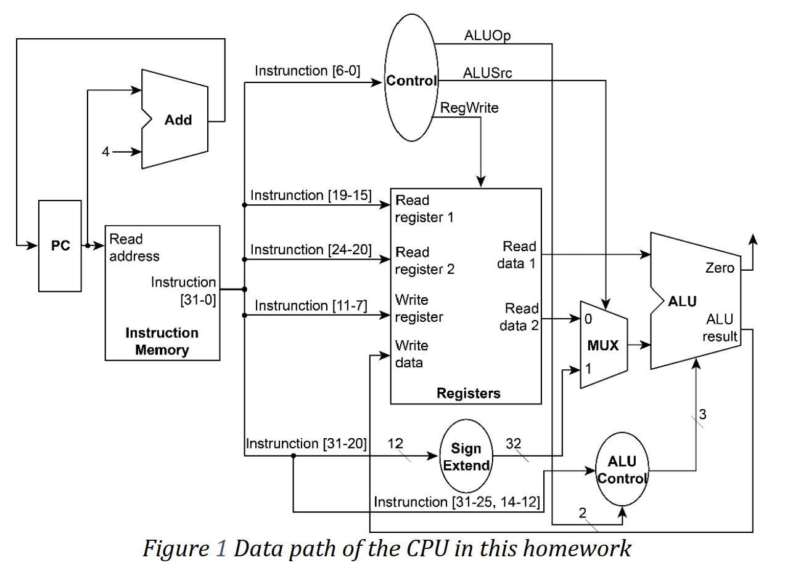

# HW3: RISC-V Single-cycle CPU Implemented with Verilog
 Student ID: b07502165 | Name: 賴昭蓉 | Date: 2022/11/8 

## Modules Explanation
The following are the modules I implemented in this homework.

### Adder
Input two 32-bit `data`, then add them immediately to output result 32-bit `data` using continuous assignment. This module is used for program counter adder. That is, program counter is added by 4 every clock for next instruction.

### Control
Input 7-bit opcode, then output its corresponding 2-bit `ALUOp`, `ALUSrc` and `RegWrite` (datapath shown in figure). In this homework, we have I-Type and R-Type instruction, which differ in one of input sources for ALU calculation. I set `ALUOp` as 00 for I-Type, and 10 for R-Type.

### ALU_Control
Input 10-bit `funct`, 2-bit `ALUOp`, then output corresponding 3-bit `ALUCtrl` for ALU module to decide which operation to take. Note that funct7 and funct3 instruction field are concated and treated as one input `funct` here. As for I-type which might not have funct7 instruction field, I only look into part of `funct`. 

1-to-1 mapping input `funct` and output `ALUCtrl` is used here by procedural assignment with case-switch under the change of the input. The following table is the mapping.

ALUOp | funct3 | funct7 | ALUCtrl | ALU operation
---   | --- | --- | --- | --- 
00    | 000 | xxxxxxx | 010 | Add
00    | 101 | xxxxxxx | 101 | Srai
10    | 000 | 0000111 | 000 | And
10    | 000 | 0000100 | 111 | Xor
10    | 000 | 0000001 | 100 | Sll
10    | 000 | 0000000 | 010 | Add
10    | 010 | 0000000 | 110 | Sub
10    | 000 | 0001000 | 011 | Mul

Further simplification such as using "don't-care" might be used to speed up, but I found current setting enough for finishing one instruction in one clock time.

### Sign_Extend
Input 12-bit `data`, immediately sign-extend 20 bits using its MSB, and then output the result 32-bit `data`. We use this module for sign-extending data in immediate field. 

Note that for "srai" operation, although it only have 5-bit of immediate value, we still sign-extend its 12-bit value in corresponding instruction field that might contain additional bits. That is because we don't get any control signal here to know the length of immediate field. We can let additional bits be trimmed during ALU operation.

### ALU
Input two 32-bit `data` and `ALUCtrl`, do ALU operation corresponding to `ALUCtrl`, and then output the result 32-bit `data`. We also output `zero` which is assigned as 1 whenever we get 0 on the data output. ALU operation is simply done using procedural assignment under any change in input items. Note that for "srai" operation, we only need its 5 LSB of data as second operand, otherwise we might treat its funct7 field as input.

### MUX32
Input two 32-bit `data` and `select`, choose the `data` according to `select` bit and output. This module is used to decide the second source operand for ALU operation. The `select` bit here is ALUSrc. One input data is read data from Registers while the other is immediate value from Sign_Extend module.

### CPU
Connecting input and output from each module according to their datapath. Additional wire for 32-bit instruction and 32-bit pc are used to support multiple output source. (See Figure 1)

<!--  -->

    

### Others
Instruction_Memory, Registers, PC, ...etc are implemented by TAs and are not described here.

## Development Environment

OS: Ubuntu 20.04.5 LTS in WSL2 \
compiler: iverilog