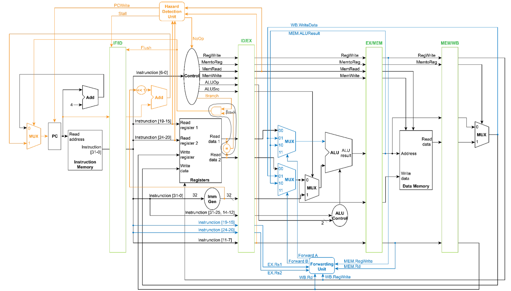

# Lab1: RISC-V Pipelined CPU Implemented with Verilog
 Student ID: b07502165 | Name: 賴昭蓉 | Date: 2022/12/4 

## Modules Implementation
### Control
Input 7-bit opcode(`Op`) and bubble(`NoOp`) bit, then output the corresponding control signal as specified in the following table.
opcode | ALUOp | ALUSrc | RegWrite | MemtoReg | MemRead | MemWrite | Branch | instruction type
---    | --- | --- | --- | --- | --- | --- | --- | ---
0110011| 10 |  0  |  1  |  0  |  0  |  0  |  0  | R Type
0010011| 11 |  1  |  1  |  0  |  0  |  0  |  0  | I Type (addi, srai)
0000011| 00 |  1  |  1  |  1  |  1  |  0  |  0  | I Type (lw)
0100011| 00 |  1  |  0  |  0  |  0  |  1  |  0  | S Type (sw)
1100011| 01 |  0  |  0  |  0  |  0  |  0  |  1  | SB Type (beq)
NoOp=1| 00 |  0  |  0  |  0  |  0  |  0  |  0  |

### ALU Control
Input 10-bit `funct`, 2-bit `ALUOp`, then output corresponding 3-bit `ALUCtrl` for ALU module to decide which operation to take.

instruction | ALUOp | funct3 | funct7 | ALUCtrl | ALU function
--- | --- | --- | --- | --- | ---
and | 10 | 111 | 0000000 | 000 | &
xor | 10 | 100 | 0000000 | 111 | ^
sll | 10 | 001 | 0000000 | 100 | <<
add | 10 | 000 | 0000000 | 010 | +
sub | 10 | 000 | 0100000 | 110 | -
mul | 10 | 000 | 0000001 | 011 | *
addi| 11 | 000 | -       | 010 | +
srai| 11 | 101 | 0100000 | 101 | >>>
lw  | 00 | 010 | -       | 010 | +
sw  | 00 | 010 | -       | 010 | +
beq | 01 | 000 | -       | 110 | -

### Pipeline
There are 4 pipelines: **IF_ID**, **ID_EX**, **EX_MEM**, and **MEM_WB** in this pipelined CPU. Each pipeline stores value from previous stage in register whenever there are changes, and output the stored value to next stage at posedge. **IF_ID** should flush stored register if `flush` bit is on and should not output value if `stall` bit is on. Also, pipelines should not start working until `start` bit is on.

### Hazard Detection
Hazard Detection Unit should stall the pipeline when data hazard happens. It can detect load-use data hazard when input `MemRead` from EX stage is 1, and `Rd` from EX stage equals to `RS1addr` or `RS2addr` from ID stage. And then output `stall` and `NoOp` bits as 1 to stall the pipeline.

### Branch
Branch Unit should stall the pipeline when control hazard happens. It will check branch condition and other modules will calculate target pc at ID stage. When conditions meet, it will output `flush` bit to stall one cycle and use target pc as next program counter.

### Forwarding
Forwarding Unit should forward data from MEM stage or WB stage to EX stage when data hazard happens. It will first check MEM hazard and then check WB hazard. Data hazard happens when `RegWrite` bit is on and `Rd` equals to `RS1` or `RS2` at EX stage. It then sets `ForwardA` and `ForwardB` to control which source values to use for ALU calculation.

### Imm Gen
Imm Gen Unit excerpts part of instruction as immediate number and signed-extends immediate number to 32-bit. Different instruction has different immediate field, so it should check opcode field to deal with different cases.

### CPU
Connecting input and output from each module according to their datapath. (See Figure 1)

    

### Others
Other modules are either implemented by TA or similar to those in HW3, so are not described here.

## Difficulties and Solutions
### Pipeline Output Timing
At the beginning, I thought all components take some "time" to update wire or read from register, so I let pipeline latch output new values at negedge to make sure that all the stages have done their jobs before passing values to next stage. However, that caused some issues such as hard to debug (cycle time not aligned with value change) and one-cycle-time offset in the result compared with TA's.

Therefore, I changed the timing of outputing pipeline latch values at posedge, and everything worked nice. Also, I found out that since the registers and data memories also write value at posedge but still correctly store the value, this system can really update all the wires at the same moment. Really a interesting finding.

### Initial Value of Some Units
Not defining default values in case statement can result in many unexpected problems. For example, at the begining when there is no opcode input in Control Unit, it outputs all control signals as 'x', and the Branch Unit which requires output from Control Unit get 'x' input and also output 'x'. The next program counter, which also get input from Branch Unit, cannot output next program counter and the program stop functioning.

### Naming issues
In pipelined CPU, there are many wires sending signal with similar items. I really struggled when changing the varible names over and over again to avoid conflict. In the end, I decided to give wire name as \[pipeline_latch\]_\[variable_name\].

## Development Environment
OS: Ubuntu 20.04.5 LTS in WSL2 \
compiler: iverilog