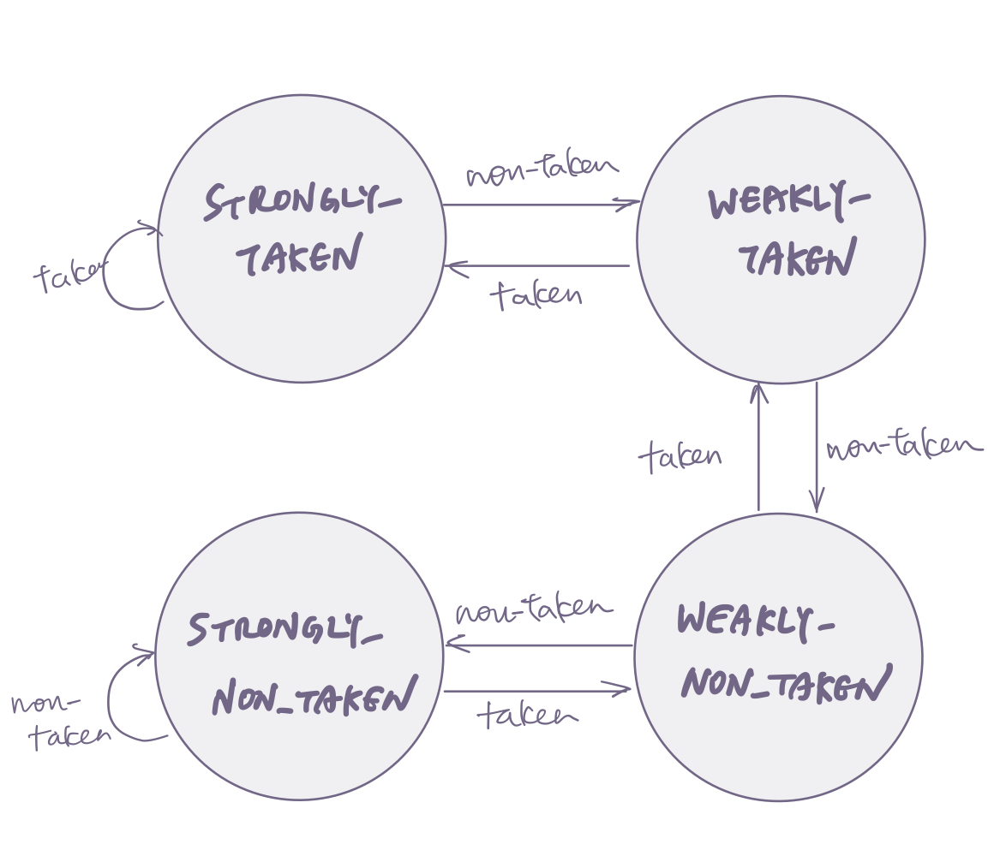
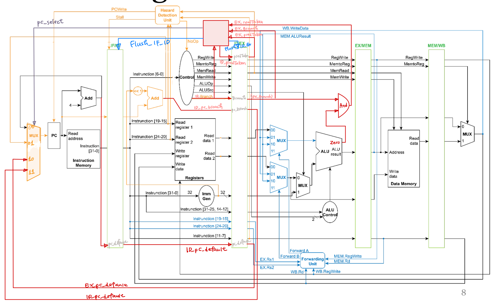

# Lab2: RISC-V Pipelined CPU with 2-bit Branch Predictor
 Student ID: b07502165 | Name:賴昭蓉 | Date: 2022/12/4 

## Modules Implementation
### Branch Predictor
Branch Predictor Unit should store the 2-bit `state` to decide the prediction. When any branch instruction reaches ID stage, it will use 2-bit `pc_select` to choose the source of the next pc based on the current `state`. If taken is chosen, it will also flush IF_ID pipeline.  
When any branch instruction reachs EX stage, it will use the calculated real branch-result (`EX_realTaken`) to update `state` based on state transition diagram (Figure 1). If `EX_realTaken` is different from the previous predicted one (`EX_predTaken`), it will flush both IF_ID pipeline and ID_EX pipeline and then use `pc_select` to choose the corrected source of the next pc.

    
    
<em>Figure 1: FSM of state transition diagram for 2-bit branch predictor</em> 

### PC MUX
PC MUX Unit is now a 4-bit MUX, since it needs to support 4 kinds of different pc sources: default pc + 4, target branch pc from instruction at ID stage, pc for instruction at EX stage + 4, and target branch pc from instruction at EX stage.

### ALU, ALU Control, and Ander
To correctly calculate the branch decision, ALU Control Unit should use ALUOp and funct field of instruction to identify branch instruction and send SUB signal to ALU Unit. ALU Unit then calculates SUB result and output `zero` meaning whether the result is equal to zero. Therefore, when `zero` bits are on and it is a branch instruction (`EX_Branch` signal is on), we know the branch should be taken.

### CPU
Connecting input and output from each module according to their datapath. (See Figure 2)

    
    
<em>Figure 2: Datapath</em> 

### Others
Other modules are either implemented by TA or similar to those in Lab1, so are not described here.

## Difficulties and Solutions
Compared with the difficulty of building up the whole CPU from scratches on Lab1, this lab is quite easier. The only difficulty was to correctly design the logic beforehand. Fortunately, I constructed a convenient workflow for myself: First design the logic in mind and sketch the datapath on iPad. And then name all the wires, making sure that there is no conflict. Write down pseudo-codes on paper and check all the logic thoroughly again. Start coding and debugging using gtk as normal. Since I was able to be very careful on paper working, the coding parts were done smoothly.

## Development Environment
OS: Ubuntu 20.04.5 LTS in WSL2 \
compiler: iverilog